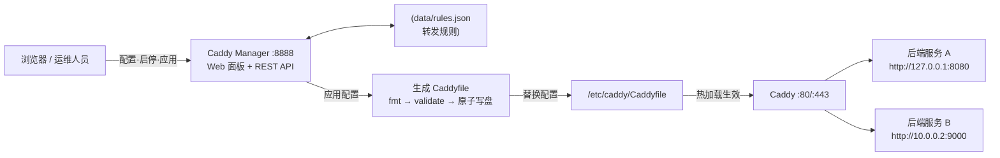
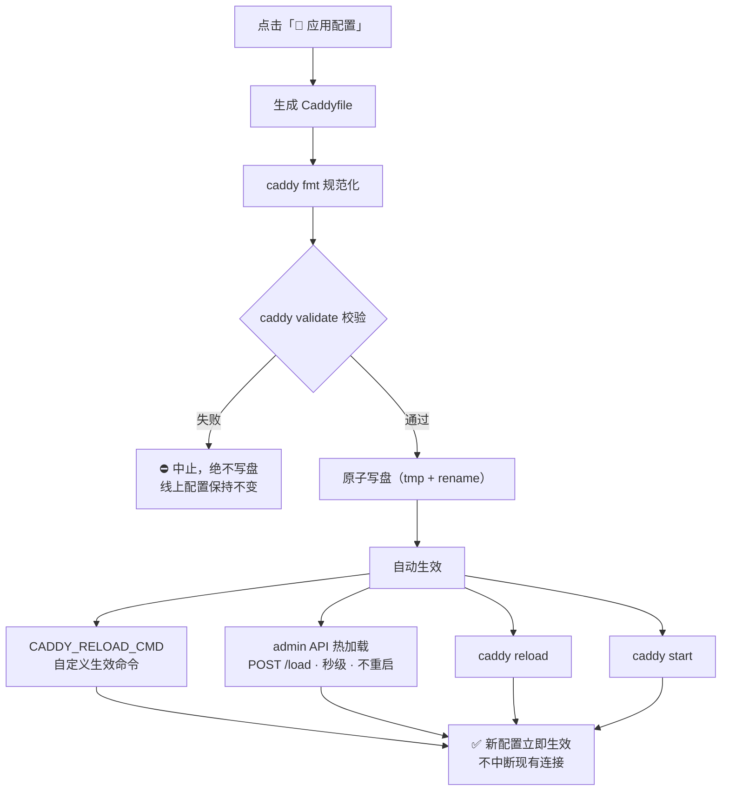
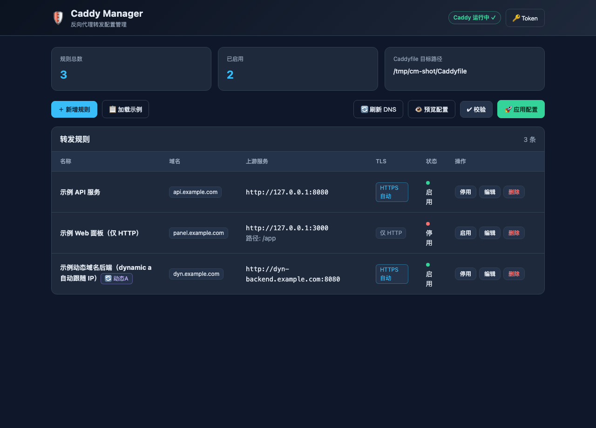

# Caddy Manager · Caddy 转发配置管理

> 在云主机上**快速配置反向代理转发**、并让 Caddy **秒级生效重启**的 Web 管理服务（默认 8888 端口）。
> 单文件二进制部署，目标机无需安装 Node。

[](LICENSE)


[](https://github.com/teddymail/caddyManager/stargazers)
[](https://github.com/teddymail/caddyManager)

---

## 解决什么痛点

运维云主机上的 Caddy 转发，传统方式是：`ssh 上云主机 → 手改 Caddyfile → 重启 Caddy → 祈祷没写错`。
每次新增/变更一个后端服务都要重复这套流程，而且：

- ❌ **改配置慢**：手写 Caddyfile 语法容易错，改错一个括号，Caddy 直接起不来，线上全挂
- ❌ **生效慢**：改完要手动 reload / restart，还要担心重启瞬间连接中断
- ❌ **服务多难管**：几十个域名/上游堆在一个文件里，改哪条都不放心，没有清单、没有开关
- ❌ **IP 变了连不上**：后端是动态域名，IP 已变但 Caddy 上游还指向旧 IP，用户直接 502

**Caddy Manager 就是为这几个痛点而生。**

---

## 两大核心能力

### ⚡ 快速生效重启 —— 改完即生效，秒级、零中断、防写挂

在面板或 API 上点「**应用配置**」，服务端自动执行完整流水线，**无需 ssh、无需手动 reload**：

```
生成 Caddyfile → caddy fmt 规范化 → caddy validate 校验（不合格绝不写盘）
→ 原子写盘 → 自动热重载生效
```

- **秒级生效**：优先走 Caddy admin API 热加载（`POST /load`），不重启进程、不丢现有连接；失败自动降级 `caddy reload` / `caddy start`，或执行你配置的 `CADDY_RELOAD_CMD`（如 `systemctl reload caddy`）
- **防写挂**：`caddy validate` 校验不过就中止，**绝不覆盖线上配置**；原子写盘（tmp + rename）保证文件永远完整
- **可回看**：每次应用有步骤反馈（校验→写盘→重载），出问题马上知道卡在哪一步

### 🚀 快速代理转发配置 —— 网页/API 建规则，不用碰 Caddyfile

> 架构与完整生效流程见下方 [架构与生效流程](#架构与生效流程)。

中文 Web 面板（或 REST API）里填一张表，就是一条转发规则：

| 字段 | 示例 | 说明 |
| --- | --- | --- |
| 名称 | 商城 API | 备注 |
| 域名 | `api.shop.com` | 支持多个、支持通配 `*.shop.com` |
| 上游服务 | `http://127.0.0.1:8080` | 支持多地址自动负载均衡 |
| TLS | 自动 HTTPS / 内网自签 / 仅 HTTP | 自动生成对应 Caddy 指令 |
| 路径 | `/api` | 可配 `uri strip_prefix` |
| 健康检查 | `/healthz` | 自动生成 health 指令 |
| 启停 | 开/关 | 关掉立即从配置中移除，不用删 |

所有规则存 `data/rules.json`，**一键生成规范 Caddyfile**，还支持：
- **动态域名 IP 自动跟随**：规则选 `dynamic a`，Caddy 定时刷新 A 记录，IP 变了自动切到新后端，无需重载（已用真实 Caddy 端到端验证）；或选「看门狗」模式由管理器定时解析并热重载
- **负载均衡**：多上游自动生成 `lb_policy round_robin`
- **批量/幂等部署**：Ansible playbook 拷一个二进制 + systemd 即完成

---

## 架构与生效流程



**应用配置 → 秒级生效链路：**



## 30 秒上手

```bash
# 方式一：源码运行（开发，需 Node >= 18）
node src/server.js
# 方式二：单文件二进制（Linux 云主机，无需 Node）
node scripts/build.mjs bun-linux-x64 && scp dist/caddymanager-linux-x64 root@云主机:/usr/local/bin/caddymanager
# 然后打开 http://localhost:8888 或 http://云主机IP:8888
```

1. 点「＋ 新增规则」→ 填域名、上游地址 → 保存
2. 点「👁 预览配置」确认生成的 Caddyfile
3. 点「🚀 应用配置」→ **Caddy 立即重新加载生效** ✅

---

## 界面预览



## 核心能力总览

| 能力 | 说明 |
| --- | --- |
| ⚡ 快速生效 | `fmt → validate → 原子写盘 → admin API 热加载`，秒级生效、零中断、校验不过绝不写盘 |
| 🚀 快速转发配置 | 中文面板 / REST API 建规则，自动生成规范 Caddyfile，支持启停、路径、TLS、健康检查 |
| 🔄 动态域名跟随 | Caddy 原生 `dynamic a` 定时刷新（无需重载）+ 管理器看门狗自动改 IP 并热重载 |
| 🌐 负载均衡 | 多上游自动 `lb_policy round_robin` |
| 📦 单文件二进制 | Bun 交叉编译 Linux x64/arm64 自包含 ELF，目标机零依赖 |
| 📦 Ansible 部署 | 拷一个二进制 + systemd + 健康检查，幂等可重复执行 |
| 🚀 高性能 | 响应缓存、Gzip、状态缓存、写盘合并；实测 ~1.2 万 QPS / 0.08ms |
| 🔐 鉴权 | `AUTH_TOKEN` Bearer 鉴权（生产必开） |

---

## 动态域名机制（重点场景）

后端大规模使用动态域名、IP 随时变化时，任选其一（推荐第 1 种，可叠加）：

### 1) Caddy 原生 `dynamic a`（推荐）

规则「动态 DNS 机制」选 `caddy`，生成如下配置 —— **Caddy 按 `refresh` 周期自行重新解析 A/AAAA 记录并替换上游池，无需任何重载，IP 一变立即跟随**：

```caddy
shop.example.com {
    reverse_proxy {
        dynamic a dyn-shop.example.com 8080 {
            refresh 30s
            versions ipv4 ipv6
        }
        health_uri /healthz
    }
}
```

> ✅ 已用真实 Caddy v2.11.4 + 本地可控 DNS 端到端验证：翻转 A 记录后，一个 refresh 周期内上游池自动切到新 IP（旧后端 0 流量），翻回后自动恢复。`dynamic a` 是标准 Caddy 内置模块，无需 xcaddy 定制编译。

### 2) 管理器看门狗（`manager` 模式）

规则「动态 DNS 机制」选 `manager`：后台守护进程按 `dnsInterval` 定时解析监听域名，**IP 变化时自动改写规则 upstream（同端口）并触发热重载**，同时记录 `resolvedIps / lastChangedAt / lastError` 便于审计。也可随时点面板「🔄 刷新 DNS」立即执行。

---

## 快速开始与配置

### 本地运行

```bash
node src/server.js          # 默认 8888 端口
```

首次运行自动创建 `data/rules.json`；`/etc/caddy` 可写时生成目标默认为 `/etc/caddy/Caddyfile`，否则为 `data/Caddyfile`。

### 环境变量

| 变量 | 默认 | 说明 |
| --- | --- | --- |
| `PORT` | `8888` | 监听端口 |
| `HOST` | `0.0.0.0` | 监听地址 |
| `DATA_DIR` | `./data` | 数据目录 |
| `RULES_FILE` | `<DATA_DIR>/rules.json` | 规则存储文件 |
| `CADDY_BIN` | `caddy` | caddy 可执行文件 |
| `CADDYFILE_PATH` | `/etc/caddy/Caddyfile`（可写时） | 生成的目标 Caddyfile |
| `CADDY_RELOAD_CMD` | 空 | 自定义生效命令，如 `systemctl reload caddy`（优先于 admin API / caddy reload） |
| `CADDY_START_CMD` | 空 | 自定义启动命令，如 `systemctl restart caddy` |
| `AUTH_TOKEN` | 空 | API Bearer Token（生产必设） |
| `GLOBAL_TLS_EMAIL` | 空 | 全局 ACME 邮箱 |
| `DNS_WATCH_INTERVAL_MS` | `5000` | 看门狗扫描间隔 |
| `QUIET` | 空 | `1` 时关闭请求日志，提升吞吐 |

### REST API

| 方法 | 路径 | 说明 |
| --- | --- | --- |
| GET | `/api/status` | Caddy 状态、配置路径、动态规则数 |
| GET/POST | `/api/rules` | 规则列表 / 新建 |
| GET/PUT/DELETE | `/api/rules/:id` | 详情 / 更新 / 删除 |
| POST | `/api/rules/:id/toggle` | 启用/停用 |
| GET | `/api/preview` | 预览生成的 Caddyfile |
| POST | `/api/apply` | 应用配置：`{dryRun:true}` 仅校验；`{writeOnly:true}` 仅写盘；默认完整生效 |
| POST | `/api/refresh-dns` | 立即解析动态域名 + 自动更新 + 热重载 |
| POST | `/api/examples` | 载入示例规则 |

规则字段：`name`、`domains`、`upstream`（支持多地址）、`path`、`stripPrefix`、`tls`（auto/internal/off）、`healthPath`、`extra`、`enabled`、`dnsMode`（off/caddy/manager）、`dnsHost`、`lookupInterval`、`dnsInterval`、`dnsResolvers`。

---

## 部署（Linux 云主机）

**方式 A：单文件二进制（推荐，无需 Node）**
```bash
node scripts/build.mjs bun-linux-x64        # 或 bun-linux-arm64（产物在 dist/）
scp dist/caddymanager-linux-x64 root@云主机:/usr/local/bin/caddymanager
ssh root@云主机 "caddymanager"              # 生产请用 systemd 托管（deploy/caddymanager.service）
```

**方式 B：源码运行（开发/调试，需 Node >= 18）**
```bash
sudo bash deploy/install.sh
```

**方式 C：Ansible 一键部署（批量/幂等）**
```bash
node scripts/build.mjs bun-linux-x64
vim deploy/ansible/inventory/production/hosts       # 改成你的云主机
vim deploy/ansible/inventory/production/group_vars/all.yml
ansible-playbook -i deploy/ansible/inventory/production/hosts deploy/ansible/playbook.yml
```

生产建议：`AUTH_TOKEN` 必设；`CADDY_RELOAD_CMD=systemctl reload caddy` 交给 systemd 管理 caddy。

---

## 测试与验证

```bash
npm test                          # 27 项单元/API 测试
node scripts/e2e-dynamic-dns.mjs  # 端到端验证 Caddy dynamic a 自动跟随 A 记录变化
```

应用配置流水线（`POST /api/apply`）：
1. 生成 Caddyfile
2. `caddy fmt` 规范化
3. `caddy validate` 校验（**不合格绝不写盘**）
4. 原子写盘（tmp + rename）
5. 生效：自定义命令 → admin API 热加载 → `caddy reload` → `caddy start`

## 安全提示

- 本服务可改写 Caddy 配置并触发重载，**必须设置 `AUTH_TOKEN`**，且建议仅在内网/VPN 内暴露 8888 端口。
